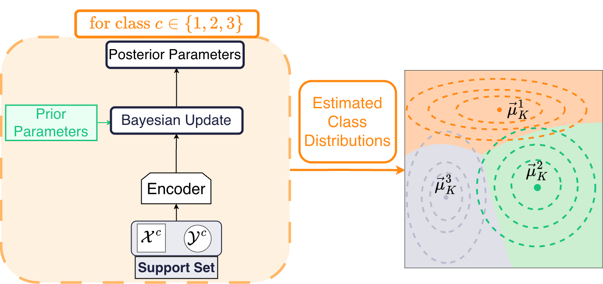
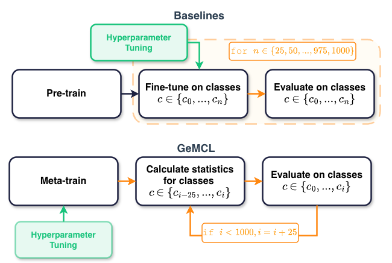
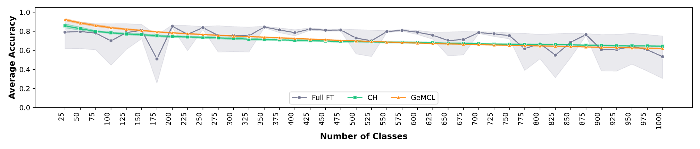

Keyword spotting (KWS) is one of the applications of spoken word classification. It is ideal in KWS for the user to define their own keywords, and for the KWS model to only need a few examples to learn the new keywords. It would be cumbersome if the user had to repeat the new keyword many times for the model to learn it.

In the KWS, models often deal with learning few words as they are used on edge devices. Even with few words there are still limitations in performance [[4]](#ref4). 

Ideally, classifiers in the few-shot continual learning scenario are able to scale to large numbers of classes which extends the scope of problems they can be applied to. 
However, in practice it is common to make use of foundation models such as HuBERT [[5]](#ref5). As new data arrives the model is often finetuned/trained from scratch on the entire dataset in order to prevent catastrophic forgetting. This process is computationally expensive.

Meta-continual learning is a framework that potentially allows us to train classifiers without needing to finetune from scratch, while still preventing catastrophic forgetting. It is defined as learning how to continually learn [[6]](#ref6). Algorithms in this framework are often trained from scratch across a distribution of tasks in order to generalise to unseen tasks. This training process is computationally expensive, but this upfront cost is offset at inference time through rapid adaptation to new tasks and new data. Generative Meta-Continual Learning (GeMCL) [[1]](#ref1) is an algorithm that fits into this framework.

To the best of our knowledge, GeMCL has yet to be applied to audio data. Therefore, our research question is as follows: In a few-shot continual learning setting scaled to 1000 classes, is it more practical to continually finetune HuBERT, or to meta-train GeMCL from scratch?


## GeMCL

To answer our research question it is important that we first start with GeMCL. GeMCL [[1]](#ref1) uses a generative Bayesian classifier and models the distribution of each class. We assume each class, $$c$$, is modelled by a Gaussian distribution with mean $$\mu^c$$ and precision $$\lambda^c$$. The class conditional Gaussians form a Gaussian Mixture Model (GMM).

The mean $$\mu^c$$ is also modelled by a Gaussian, for which we assume uninformative priors. The precision is modelled by a Gamma distribution. The posterior distributions of the mean $$\mu^c$$  and the precision $$\lambda^c$$ take the form of a Normal-Gamma distribution. This allows us to calculate the posterior parameters using closed-form equations as we learn a class. The predictive distribution is a Student’s t-distribution.

Now, assume we are attempting to solve a classification episode containing $$N$$ classes, with $$K$$ training samples for each class, which we call the support set. This type of episode is known as an $$N$$-way-$$K$$-shot episode. The test samples of the classes are known as the query set. During an $$N$$-way-$$K$$-shot episode, the encoder receives the input and outputs the feature representation of that input. We then use Bayes' Theorem to obtain the posterior parameters of the class-specific distributions using the representation of the input and the prior. Figure 1 illustrates an example of the GeMCL process for learning the class statistics using the support set.

<p align="center">
  
</p>
<p class="caption">Figure 1: An example of the GeMCL procedure for learning class statistics for a classification task with three classes and K samples in each class.</p>

In GeMCL, since each class possesses its own set of parameters and is modelled by separate Gaussians, updating the class-specific parameters for class $$1$$ has no effect on the parameters for classes $$2$$ and $$3$$. The class parameters are isolated. Therefore, GeMCL is immune to catastrophic forgetting [[1]](#ref1)[[2]](#ref2).

The order in which we learn the classes does not matter. We can learn the classes in any sequence and arrive at the same distribution for that class, as the class parameters are isolated. Furthermore, GeMCL makes no assumption regarding the maximum number of classes. To learn a new class, we simply learn the statistics of that class's representations.

To make predictions on the query set, we make use of the predictive distribution to select the class that assigns the highest probability to the observed data point from the query set. 

## Empirical Design

### Data
We make use of the English data from the Multilingual Spoken Words corpus (MSWC) dataset [[3]](#ref3). It consists of one-second audio segments of individual words. A train/dev/test split is provided; however, we only make use of the test and train split. Each word contains samples in each split and we filter out any words that do not have at least five valid examples in the test and train splits. After the great filtering we are left with 12 736 words. The words are then randomly split into the meta-training set and meta-test set with a 70 : 30 split respectively. Therefore 8 915 words are used for meta-training and 3 821 words are used for meta-testing.

### Model training and evaluation
To train the encoder of GeMCL we make use of meta-training. Meta-training involves training the model on a distribution of tasks (in our case $$N$$-way-$$K$$-shot episodes) whereas meta-testing is evaluating whether the model can generalise to new, unseen tasks. We make use of the meta-trained words to generate the classification episodes. We meta-train for 5 000 steps. Each step involves a batch size of 16 25-way-5-shot episodes. The performance on the query set of the meta-training words is then used to update the encoder. 

We use two methods of adapting the HuBERT baseline: 1.) full finetuning; 2.) training a classifier head and projector on a frozen backbone. The training runs start from the HuBERT base checkpoint. The model parameters range from 94 575 001 (for 25 classes) to 94 825 576 (for 1000 classes). We train both baselines for 200 epochs if the number of classes is below 300, and 500 epochs if the number of classes is above 300.
Each training run starts from the HuBERT base checkpoint, for sets of classes in the range [25, 1000] where the number of classes is incremented by 25 and each class has 5 training samples.

<p align="center">
  
</p>
<p class="caption">Figure 2: A comparison of the training and evaluation flows of the baselines and GeMCL.</p>

GeMCL is evaluated on the meta-test words, whereas HuBERT is trained and evaluated on the meta-test words. During this evaluation procedure, the encoder of GeMCL is fixed and uses the support set of the meta-test words to learn the class statistics of the meta-test words. HuBERT and GeMCL are evaluated on the query set of the meta-test words in a continual learning fashion, illustrated in Figure 2.

<!-- ### Hyperparameters -->

<!-- ## Implementation Details

```yaml
# All three (GeMCL, Full FT, CH)
class_increment: 25
class_range: [25, 1000]

# GeMCL
encoder: 12-layer, 12-head transformer
input: MFCC
mfcc:
  sample_rate: 16000
  frame_length: 25ms
  frame_shift: 10ms
  mel_filterbanks: 40
  cepstral_coeffs: 13
train_shots: 5
test_shots: 5
n_way: 25
meta_train_steps: 5000
batch_size: 16
learning_rate: 5e-5
weight_decay: 1e-2

# HuBERT baseline (Full FT + CH)
base_model: HuBERT base
input: raw waveform (zero-padded to batch max length)
optimizer: AdamW
batch_size: 32
epochs:
  below_300_classes: 200
  from_300_classes: 500

# Full FT
learning_rate: variable (depends on number of classes)
trainable_params: all

# CH
learning_rate: 3e-4
trainable_params: projector + classifier head only
``` -->

## Result
Figure 3 shows the accuracy of the baselines and GeMCL. The results indicate that the full FT baseline is able to outperform GeMCL and the CH model for most of the stages of continual learning. However, take note of the fluctuation in performance and the confidence interval of the full FT baseline. This indicates that the full FT is not stable. The CH model and GeMCL model are more stable. 


<p align="center">
  
</p>
<p class="caption">Figure 3: The average accuracy of GeMCL, full FT and the CH models with 95% confidence intervals.</p>

This stability observation is also shown in Table 1.

|  | GeMCL | CH | Full FT |
|---|:---:|:---:|:---:|
| Volatility (mean) | 0.48 | 7.13 | 24.55 |
| Volatility (stddev) | ±3.32 | ±13.63 | ±39.25 |

<p class="caption">Table 1: Per-word volatility of classification accuracy. Given accuracy in %, volatility is the mean absolute amount that accuracy changes between consecutive continual learning steps.</p>

The CH model does outperform GeMCL at 1000 classes by 2% but GeMCL takes less time for training, tuning and few-shot adaptation as highlighted in Table 2.

|  | GeMCL | CH | Full FT |
|---|:---:|:---:|:---:|
| Meta- / Pre-train | 27.55 | ~1976 | ~1976 |
| Hyperparameter search | 15.29 | 40.26 | 70.00 |
| Few-shot adaptation | 0.06 | 124.25 | 185.96 |

<p class="caption">Table 2. Time taken in hours on a single GPU - the HuBERT numbers are calculated from 100k steps taking approximately 9.5 hours on 32 GPUs. The hours reported are cumulative - the adaptation time is taken over all shots ingested.</p>

 <!-- As shown, full finetuning is known to be sensitive to the choice of hyperparameters, and so it trades stability for performance. CH is less flexible but, it is more stable, since no previously-trained parameters are updated. -->

## Conclusion
We evaluated GeMCL and the HuBERT baselines on 5-shot spoken word classification tasks, scaling up to 1000 classes in a continual learning setting. CH baseline outperformed GeMCL at 1000 classes; however, GeMCL did not undergo any finetuning or retraining as new words arrived. As new words arrived, GeMCL simply performed closed-form updates to word-class statistics. GeMCL was also more stable than the full FT baseline. Therefore in a few-shot continual learning setting scaled to 1000 classes, it is more practical to meta-train GeMCL from scratch.

## References

1. <a id="ref1"></a>M. Banayeeanzade, R. Mirzaiezadeh, H. Hasani, M. S. Baghshah, "Generative vs Discriminative: Rethinking The Meta-Continual Learning," *Proceedings of the 35th International Conference on Neural Information Processing Systems (NeurIPS)*, pp. 21592–21604, 2021.

2. <a id="ref2"></a>S. Lee, H. Jeon, J. Son, G. Kim, "Learning to Continually Learn with the Bayesian Principle," *International Conference on Machine Learning (ICML)*, 2024.

3. <a id="ref3"></a>M. Mazumder, S. Chitlangia, C. Banbury, Y. Kang, J. M. Ciro, K. Achorn, D. Galvez, M. Sabini, P. Mattson, D. Kanter, G. Diamos, P. Warden, J. Meyer, V. Janapa Reddi, "Multilingual Spoken Words Corpus," *Thirty-fifth Conference on Neural Information Processing Systems Datasets and Benchmarks Track (Round 2)*, 2021. [[link]](https://openreview.net/forum?id=c20jiJ5K2H)

4. <a id="ref4"></a>Q. N. Vu, L. S. Martinez-Rau, Y. Zhang, N.-D. Tran, B. Oelmann, M. Magno, and S. Bader, "Efficient Continual Learning in Keyword Spotting using Binary Neural Networks," *2025 IEEE Sensors Applications Symposium (SAS)*, pp. 1–6, 2025.

5. <a id="ref5"></a>W.-N. Hsu, B. Bolte, Y.-H. H. Tsai, K. Lakhotia, R. Salakhutdinov, and A. Mohamed, "HuBERT: Self-Supervised Speech Representation Learning by Masked Prediction of Hidden Units," *IEEE/ACM Transactions on Audio, Speech, and Language Processing*, vol. 29, pp. 3451–3460, 2021.

6. <a id="ref6"></a>J. Son, S. Lee, and G. Kim, "When Meta-Learning Meets Online and Continual Learning: A Survey," *IEEE Transactions on Pattern Analysis and Machine Intelligence*, vol. 47, no. 1, pp. 413–432, 2024.

## Citation

```bibtex
@inproceedings{beyers2026scaling,
  title={Scaling few-shot spoken classification with generative meta-continual learning},
  author={Beyers, Louise and Ziki, Batsirayi Mupamhi and van der Merwe, Ruan},
  booktitle={Proceedings of Interspeech 2026},
  year={2026}
}
```